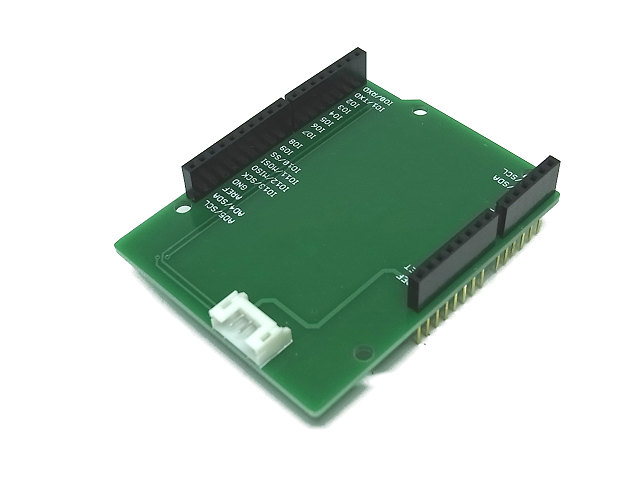
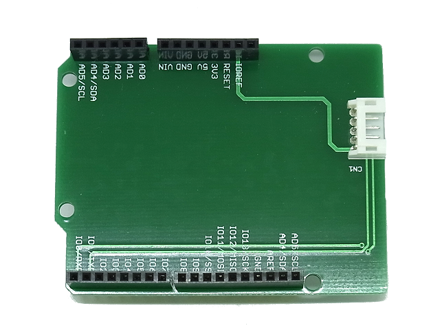

Communication Shield
=========

  
The Communication Shield is designed as easy to connect to the uart pins.
This shield adapts with any dev board that has an Arduino standard footprint.

Repository Contents
-------------------
* **/Hardware** - All Eagle design files (.brd, .sch)
* **/Cables** - Cables info

Description(Pin Interfaces)
-------------------

### CN1 Pin Descriptions:
| Pin | Name  | Description                                       |
| --- | ----- | ------------------------------------------------- |
| 1   | IOREF | It depends on your board voltage reference        |
| 2   | TX    | It connects to the IOL-0pin                       |
| 3   | RX    | It connects to the IOL-1pin                       |
| 4   | GND   | GND                                               |
| 5   | -     | No connection.                                    |

License
-------------------
The repository is released under [Creative Commons ShareAlike 4.0 International](https://creativecommons.org/licenses/by-sa/4.0/).

Distributed as-is; no warranty is given.
